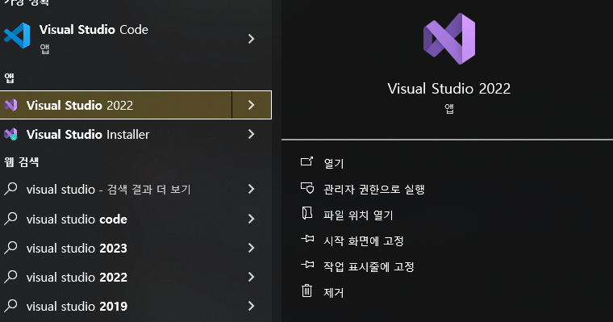
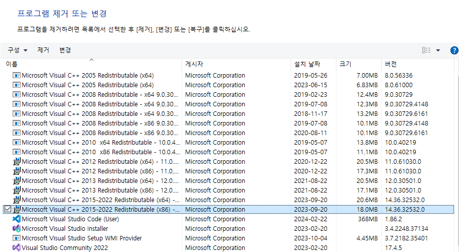
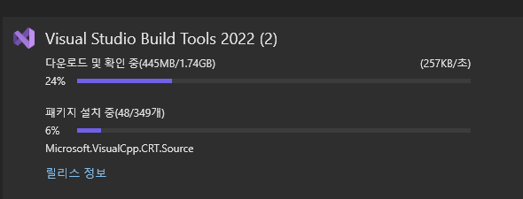

# error: linker `link.exe` not found

Windows 환경에서 cargo run 으로 빌드하였을때 나타난 오류.


웹서핑으로 찾아보니
Rust Compiler는 Visual C++ Bulid Tools 를 사용한다고 하는데 위에서 오류난 `link.exe`가 컴파일된 오브젝트 파일을 라이브러리들과 링크시켜주는 용도로 사용되는 빌드 툴의 일종이라고 함.

```log
error: linker `link.exe` not found
  |
  = note: program not found

note: the msvc targets depend on the msvc linker but `link.exe` was not found

note: please ensure that Visual Studio 2017 or later, or Build Tools for Visual Studio were installed with the Visual C++ option.

note: VS Code is a different product, and is not sufficient.

```

> 콘솔을 자세히 보면 이와 같은 에러가 떠있다.

```log
오류: 링커 `link.exe`를 찾을 수 없음
  |
  = 참고: 프로그램을 찾을 수 없음

참고: msvc 대상은 msvc 링커에 의존하지만 `link.exe`를 찾을 수 없습니다.

참고: Visual Studio 2017 이상 또는 Visual Studio용 빌드 도구가 Visual C++ 옵션과 함께 설치되었는지 확인하세요.

참고: VS Code는 다른 제품이며 충분하지 않습니다.
```

> 해당 메시지를 번역해본 결과

위 오류 로그 중에서 `Visual Studio 2017 이상 또는 Visual Studio용 빌드 도구가 Visual C++ 옵션과 함께 설치되었는지 확인하세요.` 부분을 주의 깊게 보면 Visual Studio 2017 이상의 버전이 C++ 옵션으로 설치되어야 함을 알 수 있다.

> 🤔 hmm... 2022로 깔았던 기억이 있지만.. 확인을 해보자.


Visual Studio 2022를 깔았던 흔적이 있다.


제어판 에서 확인해보니 갖가지 Visual C++ 이 깔려있는데 ...
2015 - 2022로는 안되는건가 ?

우선 서치를 하여 마이크로소프트 공식 홈페이지에서 `Visual Studio 2022용 빌드 도구`를 다운로드 하여 설치해보기로 함.

> https://aka.ms/vs/17/release/vs_BuildTools.exe

무려 6GB 다운로드를 한다 .. 엄청 오래걸리네 ㅠㅠ

속도 왜이래 ...

## 참조

> https://techlog.gurucat.net/384
