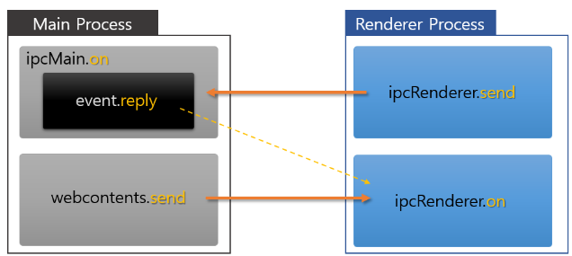

# Electron IPC 

## 업무중에 일렉트론으로 배포해야하는 상황
- 일렉트론을 톱아보던 중 IPC에 대한 개념이 생소하여 찾아보았다.

## what is IPC?
IPC는 프로세스 간 통신을 의미한다.
Electron은 IPC를 사용하여 Main 프로세스와 Renderer 프로세스 간에 직력화 된 JSON 메시지는 동기적 또는 비동기적으로 통신한다.

## IPC 모듈

- `IPC`는 프로세스 간 통신을 의미함. 
  - 프로세스란 `Main 프로세스`와 `Renderer 프로세스`를 의미한다.
  - 예를 들어 Main 프로세스는 서버로 생각하고 Renderer 프로세스는 브라우저라고 생각한다면 서버와 브라우저 간 통신을 하기 위한 규약이 필요하다. 이를 Electron에서는 `IPC`가 처리
- **IPC는 `on`을 통해 메시지 또는 이벤트를 수신하고 `send`를 통해 메시지 또는 이벤트를 전달**

### Main Processor

- **Electron 앱의 진입점이기도 하며, 앱의 Life Cycle을 관리**
- 애플리케이션에서 사용되는 메뉴, Dock, 트레이와 같은 네이티브 요소를 관리하며 Main 프로세스는 앱에서 각각의 새로운 Renderer 프로세스를 생성
- Chromium에서 이러한 개념을 Browser 프로세스라 하며, Electron에서는 **Renderer 프로세스와 혼동을 피하고자 Main 프로세스**라 명명
- Main 프로세스는 Electron 시스템 내 동작하는 애플리케이션을 제어하는 프로세스

### Renderer Processor

- `Renderer 프로세스`는 Electron 앱의 Chromium 기반의 브라우저 창을 관리하는 모듈
- **Main 프로세스와 달리 Renderer 프로세스는 여러 개가 존재할 수 있으며, Main 프로세스와는 1:N의 관계를 맺는다.**

## ipcMain

- `ipcMan` 모듈은 Renderer 프로세스(웹 페이지)가 보내는 메시지 또는 이벤트를 동기적 혹은 비동기적으로 처리
- 웹 페이지를 처리하는 프로세스인 Renderer 프로세스가 보내는 메시지를 Main 프로세스는 수신하여 처리
- **ipcMain에서는 IPC 통신을 할 때 수신만 할 수 있다.**  
- 이벤트 수신은 `on`이며 송신은 `send`라 하였지만, ipcMain에서는 `on`으로 송신을 하며 `send`가 아닌 `reply`로 회신하는 것이다.

## ipcRenderer

- `ipcRenderer` 모듈은 Renderer 프로세스(웹 페이지)에서 Main 프로세스로 동기 또는 비동기 메시지를 보낼 수 있다. 
- Main 프로세스에서 webContents.send 로 메시지를 보냈다면 수신 역시 가능하다.
- 보통 웹 페이지 딴에서 HTTP 통신을 통해 받아온 데이터를 보내거나 Main 프로세스를 호출할 경우 사용되며, `send`를 통해 송신하고 `on`을 통해 수신한다.

## 출처
> https://kdydesign.github.io/2020/12/23/electron-ipc-communication/

