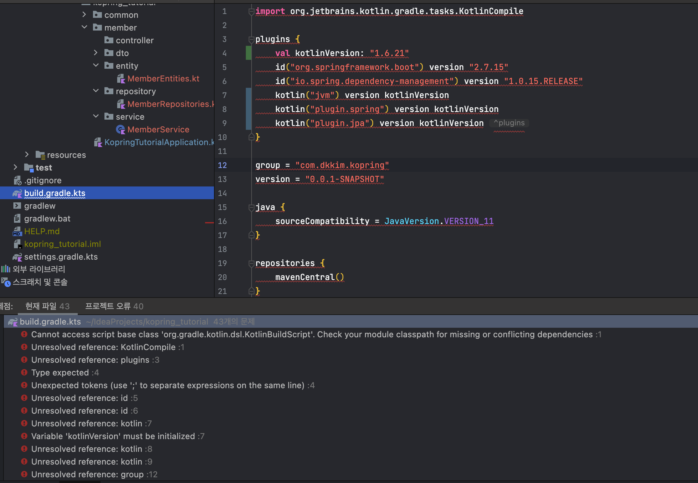
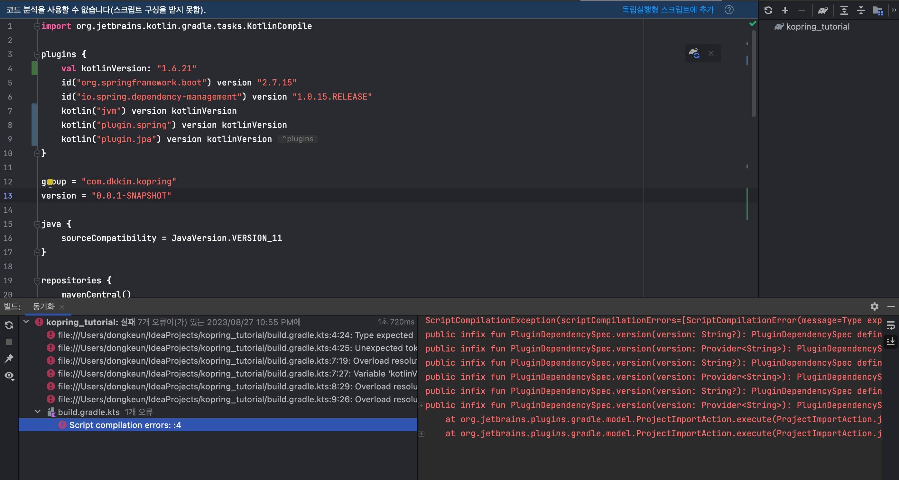
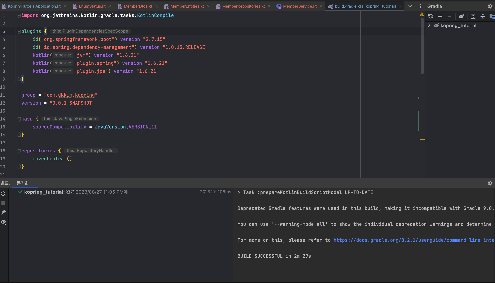

# build.gradle.kts 에러 

- Cannot access script base class 'org.gradle.kotlin.dsl.KotlinBuildScript'. Check your module classpath for missing or conflicting dependencies

해당 오류가 발생하면서 gradle.kts의 모든 라인이 빨갛게 변해버렸다!!
엄청난 에러를 동반하는 현상이 ...

## 해결법 
### 캐시 제거 및 ~/.gradle, .idea 프로젝트 디렉토리 제거 후 프로젝트 리로드 
- https://youtrack.jetbrains.com/issue/KTIJ-893/Gradle-Kotlin-DSL-Cannot-be-Parsed-Cannot-access-script-base-class-org.gradle.kotlin.dsl.KotlinBuildScript.-Check-your-module

#### 결과 

> 새로운 오류 발생 🤣

### 해결법2 

- plugin 내부의 변수로 선언한 버전에 오류 표기가 있는 것으로 보아 지원을 하지 않는 것을 보임 
- `val kotlinVersion = "1.8.21"` 해당 코드를 제거 한 후 재실행 

- 결과는 성공적
- 다른 예제들이나 강의 등에서는 플러그인 내부에 변수를 선언했었는데, java 11을 쓰려고 한 나의 코틀린 버전이 낮아서 그런건지 확인이 필요해 보인다 😭