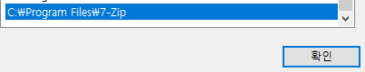
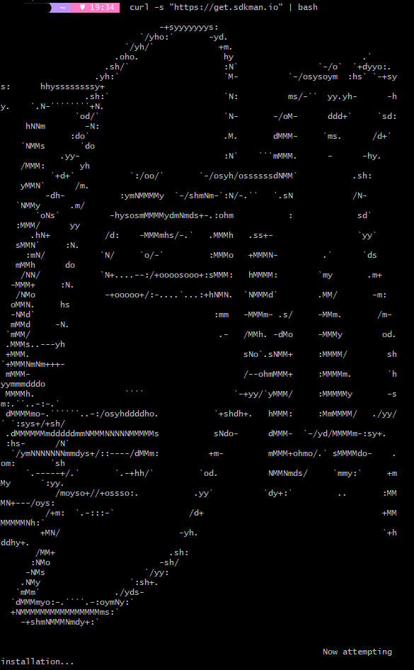
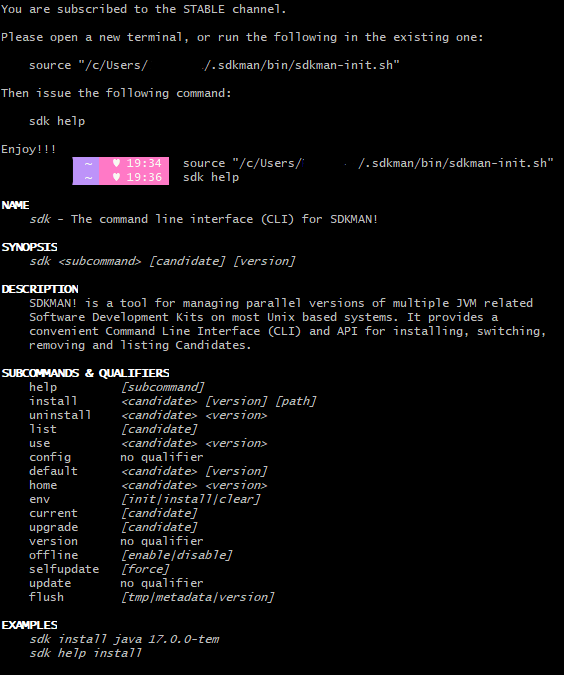
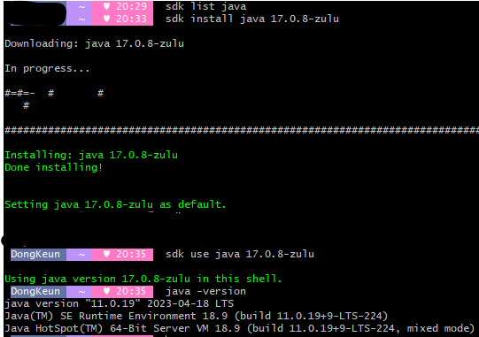

> 2023-09-10

# windows JAVA (JDK) 버전 변경

하나의 PC에서 여러 프로젝트를 진행하다 보면 JDK버전을 계속 바꿔주어야 하는데, Windows에서는 변경하기가 불편하다.

> 코틀린 스프링부트 2.x로 진행하려니 생각보다 요즘 래퍼런스에는 잘 나오지 않는다. 😢

## 직접 변경

## SDKMAN


> https://sdkman.io/

-   mac의 jenv와 같이 SDKMAN 이라는 서드파티가 존재
-   UNIX, macOS, Linux 및 Windows(WSL 포함)에서 쉽게 설정
    > 개인적으로 mac OS에서는 jenv를 사용 중.
-   SDK 버전을 여러 개를 설치를 해두고 관리
    -   사용자가 쉽게 버전 변경 하여 사용 용이하게 해줌
    -   명령어를 통해 손쉽게 버전 변경 가능
-   여러가지 SDK를 지원하지만 JDK를 위하여 사용
    > Kotlin + SpringBoot를 진행 중인데 M1 Chip에서 SpringBoot 3.x를 사용하는것이 더 용이하다고 판단. windows 환경도 많이 사용하므로 sync를 맞추기 위함.

> 맥북 에어지만 계속 가지고 다니기 힘들어요 😢

### 사전 필수 사항

#### Git for Windows

-   windows에서 사용 가능하지만, sdkman 자체가 unix 기반이라서 unix 명령어를 사용 할 수 있어야 함.
-   일반적으로 개발을 하게 되면 git-scm을 설치하며 git bash가 설치 되어 있으므로 git-bash를 사용.

#### 7-zip

-   7-zip 설치
    -   https://www.7-zip.org/
-   설치 완료 후 설치 경로를 환경 변수에 추가
    -   기본 설치 시 `C:\Program Files\7-Zip` 경로로 설치된다.
    -   
-   git bash를 열어 7-zip 명령어가 실행 되는지 확인
    -   해당 경로에 들어가서 exe 파일 확인해보니 `7z`로 되어 있다. 웹서핑을 좀 해보니 파일을 복제해서 편리한 이름으로 바꿔서 등록하는 경우가 많은 듯.
    -   

#### SDKMAN 설치

-   git bash에서 설치 명령어 입력

```bash
$ curl -s "https://get.sdkman.io" | bash
```

> 관리자 모드 실행 권장



> 뭔가 아스키 아트가 나오면서 설치가 진행된다.

-   설치가 완료되면 새로운 터미널 창을 열거나 `source "/c/Users/{Username}/.sdkman/bin/sdkman-init.sh"` 입력한 뒤 `sdk help` 명령어 인식 되는지 확인하라고 뜬다.
    -   

##### 명령어 정리

```bash
sdk list {검색어}
```

-   sdkman에서 지원하는 list를 확인 할 수 있다.
-   검색어를 넣지 않으면 모든 리스트 확인 가능
-   .e.g) sdk list java
-   다운받고 싶은 `Identifier`를 기억해두면 된다 (복사)

```bash
sdk install {sdk} {Identifier}
# sdk install java 17.0.8-zulu
```

-   설치 명령어

```bash
sdk use {sdk} {Identifier}
# sdk use java 17.0.8-zulu
```

-   설치명령어로 설치한 sdk를 사용

```bash
sdk default {sdk} {Identifier}
# sdk default java 17.0.8-zulu
```

-   기본 자바 버전으로 명명

#### 문제점 발견



-   `sdk default java 17.0.8-zulu` 까지 지정을 했지만, java -version으로 버전 확인을 했을때 이전 버전으로 뜨는 경우 발생.
-   `https://kimvampa.tistory.com/308` 해당 링크에서 환경 변수 지정 하는 탭을 보고 문제 해결 🤞

## reference

-   https://sdkman.io/
-   https://kimvampa.tistory.com/308
-   https://youngwonhan-family.tistory.com/entry/SDKMANSDK-%EB%A7%A4%EB%8B%88%EC%A0%80-%EC%9C%88%EB%8F%84%EC%9A%B0-%EC%84%A4%EC%B9%98-springboot-%EB%B2%84%EC%A0%84-%EA%B4%80%EB%A6%AC-%EC%98%88
